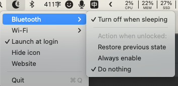

# Hackintosh_ONDA-H410D4-IPC_15-10500_UDH630

趁着618,新组了套thin itx的黑果。之前的dq77kb可以退休养老了。
这是我自己组装的机器，由于机器还在手中，并作为我的主要业余生产力工具，我会对机器的EFI进行持续的更新，如果你的机器和我的机器的配置相同或者类似，你也可以使用我的EFI文件进行安装使用，当然在使用中如果有优化也可以将它分享给我，共同进步！

### 我的电脑配置：

| 硬件名称 | 型号                                          |
|------|---------------------------------------------|
| CPU  | i5-10500                                    |
| 主板   | 昂达H410D4 IPC ITX主板                          |
| 内存   | 金士顿 32g 2666✖️2                             |
| 硬盘   | Solidigm P44 pro nvme 2T                    |
| 网卡   | Intel AX210 WIFI6   |
| 机箱   | sktc tx03                                   |
| 电源   | 尚巡 150W 华硕便携                                |
| 散热   | sett intel 的1U纯铜散热（5D471）换了静音风扇             |
| 声卡   | ALC662 (alcid=5) (听说有的主板声卡是ALC883了,alcid=7） |

### 在macos 15 下启用intel原生wifi（非HeliPort+itlwm) (目前macos 26下只能走HeliPort+itlwm来驱动wifi，等oclp更新看看能不能解决wifi问题)
1. 使用本仓库最新版本的efi配置，默认就是该配置。
2. 下载[OCLP-Mod](https://github.com/laobamac/OCLP-Mod/releases)
3. 运行OCLP-Mod 3.0.0。点击“安装驱动补丁”按钮，打上补丁就可以正常运行wifi了。目前intel网卡支持单方面的airdrop（只能发不能收）。

### ~~关于在 macos 14(Sonoma) 下启动苹果原生的博通网卡~~

1. ~~使用本仓库最新版本的efi配置~~
2. ~~使用opencore编辑器，进入Kernel\add，去掉intel的wifi和蓝牙驱动:`BlueToolFixup.kext`、`IntelBTPatcher.kext`、`IntelBluetoothFirmware.kext`、`AirportItlwm13.kext`、`AirportItlwm14.kext`~~
3. ~~使用opencore编辑器，进入Kernel\add，打开oclp需要的博通wifi相关驱动：`IOSkywalkFamily.kext`、`IO80211FamilyLegacy.kext`、`IO80211FamilyLegacy.kext/Contents/PlugIns/AirPortBrcmNIC.kext`、`AMFIPass.kext`、`AirportBrcmFixup.kext`~~
4. ~~使用opencore编辑器，进入Kernel\block，打开`com.apple.iokit.IOSkywalkFamily`这个阻止项~~
5. ~~使用opencore编辑器，进入NVRAM,找到uuid为 `7C436110-AB2A-4BBB-A880-FE41995C9F82`，修改 `csr-active-config`项为`03080000`。修改 `boot-args`项为`ipc_control_port_options=0 -nokcmismatchpanic igfxonln=1 amfi=0x80 -v`~~
6. ~~使用opencore编辑器，进入misc\security，修改`SecureBootModel`为 `Disabled`~~
7. ~~去[OpenCore-Legacy-Patcher](https://github.com/dortania/OpenCore-Legacy-Patcher/releases/latest) 下载最新版本的oclp并安装 ~~
8. ~~打开oclp，点击`Post-Install Root Patch`，点击`Start Root Patching`。点击后进行重启，wifi就可以用了！~~

### ~~关于intel wifi 的蓝牙睡眠唤醒相关问题~~
> ~~没有遇到相关问题请忽略~~

1. ~~下载 [bluesnooze](https://github.com/stefansundin/bluesnooze/releases)~~
2. ~~~~


### bios 设置：

+
关 `cfg lock` : `Advanced -> Power & Performance -> CPU - Power Management Control -> CPU Lock Configuration -> CFG Lock`
改成 `Disabled`
+ 关 `csm`：`Advanced -> CSM Configuration -> CSM Support` 改成 `Disabled`
+
关 `安全启动`：`Advanced -> Trusted Computing -> Security Device Support`，`Security -> Secure Boot -> Secure Boot`, `Boot -> Quiet Boot`,`Boot -> Fast Boot`
改成 `Disabled`
+ 关 `vt-d`：`Chipset -> System Agent (SA) Configuration -> VT-d` 改成 `Disabled`
+ 预显存 由 `32M`
  改成 `64M`：`Chipset -> System Agent (SA) Configuration -> Graphics Configuration -> DVMT Pre-Allocated` 改成 `64M`
+ apeture size 由 `256M`
  改 `1024M`：`Chipset -> System Agent (SA) Configuration -> Graphics Configuration -> Aperture Size` 改成 `1024M`
+ DVMT Memory 改成 `Max`: `Chipset -> System Agent (SA) Configuration -> Graphics Configuration -> DVMT Total Gfx Mem`
  改成 `MAX`
+ Primary Display 改成 `IGFX`: `Chipset -> System Agent (SA) Configuration -> Graphics Configuration -> Primary Display`
  改成 `IGFX`
+ Internal Graphics
  改成 `Enabled`: `Chipset -> System Agent (SA) Configuration -> Graphics Configuration -> Internal Graphics`
  改成 `Enabled`
+ 开 `Above 4GB MMIO BIOS assignment`：`Chipset -> System Agent (SA) Configuration -> Above 4GB MMIO BIOS assignment`
  改成 `Enab'le'd`
+ ...

> 其他的bios配置 看个人爱好。比如我改了功耗墙到 150W。内存的xmp没啥用，开不开也最高到2666.

### opencore版本：

1.0.5

### macos版本：
macos Sequoia
15.7

### 说明

已做USB定制：TypeC，USB3正常 不管你前置USB链接的是哪个口都可以完美使用！

睡眠屏黑后可以唤醒，基本上完美。

已修改cpu 识别成i5，非i9。

机箱前音频(二合一hd)完美驱动。后置音频alcid=5音质还不错。

已完美解决双4K显示器同时使用的各种问题。开机直接hdmi+dp都插上就行，不用什么插拔操作。

请自行修改/添加 三码

使用 `Hackintool` -> `电源` -> `螺丝刀图标` 来修复电源相关的配置

### Win+Mac双系统解决Win系统时间时差问题

在Windows终端下使用管理员权限运行

```
Reg add HKLM\SYSTEM\CurrentControlSet\Control\TimeZoneInformation /v RealTimeIsUniversal /t REG_DWORD /d 1
```

### 设置默认启动项

    多系统在启动选择界面，先使用键盘移动到要启动的项，然后按Ctrl+Enter(回车键)进入系统，下次重启后默认就选中该项了

### 留影


