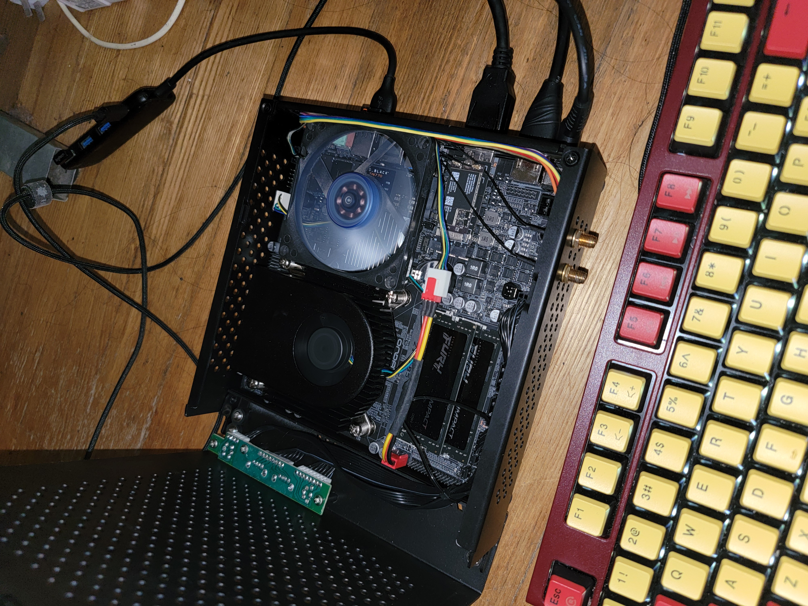

# Hackintosh_ONDA-H410D4-IPC_15-10500_UDH630
趁着618,新组了套thin itx的黑果。之前的dq77kb可以退休养老了。
这是我自己组装的机器，由于机器还在手中，并作为我的主要业余生产力工具，我会对机器的EFI进行持续的更新，如果你的机器和我的机器的配置相同或者类似，你也可以使用我的EFI文件进行安装使用，当然在使用中如果有优化也可以将它分享给我，共同进步！

### 我的电脑配置：

| 硬件名称 | 型号                      |
|------|-------------------------|
| CPU  | i5-10500                |
| 主板   | 昂达H410D4 IPC ITX主板      |
| 内存   | 金士顿 32g 2666✖️2         |
| 硬盘   | WD sn770 nvme 1T        |
| 网卡   | Bcm94360cs2             |
| 机箱   | sktc tx03               |
| 电源   | 尚巡 150W 华硕便携            |
| 散热   | 鱼巢z22   + 一个 8010风扇散热机箱 |

### bios 设置：
+ 关 `cfg lock` : `Advanced -> Power & Performance -> CPU - Power Management Control -> CPU Lock Configuration -> CFG Lock` 改成 `Disabled`
+ 关 `csm`：`Advanced -> CSM Configuration -> CSM Support` 改成 `Disabled`
+ 关 `安全启动`：`Advanced -> Trusted Computing -> Security Device Support`，`Security -> Secure Boot -> Secure Boot`, `Boot -> Quiet Boot`,`Boot -> Fast Boot` 改成 `Disabled`
+ 关 `vt-d`：`Chipset -> System Agent (SA) Configuration -> VT-d` 改成 `Disabled`
+ 预显存 由 `32M` 改成 `64M`：`Chipset -> System Agent (SA) Configuration -> Graphics Configuration -> DVMT Pre-Allocated` 改成 `64M`
+ apeture size 由 `256M` 改 `1024M`：`Chipset -> System Agent (SA) Configuration -> Graphics Configuration -> Aperture Size` 改成 `1024M`
+ DVMT Memory 改成 `Max`: `Chipset -> System Agent (SA) Configuration -> Graphics Configuration -> DVMT Total Gfx Mem` 改成 `MAX`
+ Primary Display 改成 `IGFX`: `Chipset -> System Agent (SA) Configuration -> Graphics Configuration -> Primary Display` 改成 `IGFX`
+ Internal Graphics 改成 `Enabled`: `Chipset -> System Agent (SA) Configuration -> Graphics Configuration -> Internal Graphics` 改成 `Enabled`
+ 开 `Above 4GB MMIO BIOS assignment`：`Chipset -> System Agent (SA) Configuration -> Above 4GB MMIO BIOS assignment` 改成 `Enab'le'd`
+ ...
> 其他的bios配置 看个人爱好。比如我改了功耗墙到 150W。内存的xmp没啥用，开不开也最高到2666.


### opencore版本：
0.8.1

### macos版本：
macOS Monterey
12.4

### 说明
已做USB定制：TypeC，USB3正常 不管你前置USB链接的是哪个口都可以完美使用！

睡眠屏黑后可以唤醒，但是睡眠还是有点小问题，感觉不是真正的睡眠！只是待机。

已修改cpu 识别成i5，非i9。

已完美解决双4K显示器同时使用的各种问题。开机直接hdmi+dp都插上就行，不用什么插拔操作。

请自行修改/添加 三码

使用 `Hackintool` -> `电源` -> `螺丝刀图标` 来修复电源相关的配置

### Win+Mac双系统解决Win系统时间时差问题

在Windows终端下使用管理员权限运行 
```
Reg add HKLM\SYSTEM\CurrentControlSet\Control\TimeZoneInformation /v RealTimeIsUniversal /t REG_DWORD /d 1
```

### 设置默认启动项

    多系统在启动选择界面，先使用键盘移动到要启动的项，然后按Ctrl+Enter(回车键)进入系统，下次重启后默认就选中该项了

### 留影


